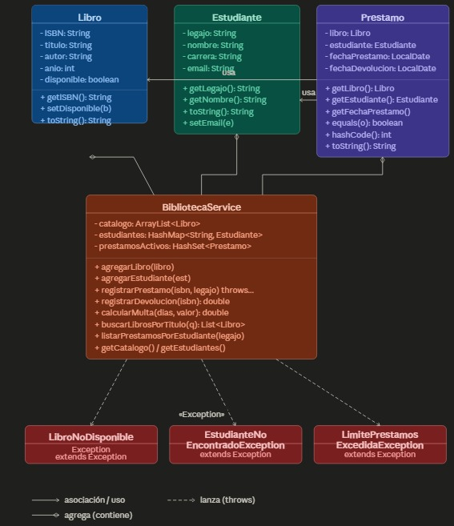

# TP1 - Sistema de Biblioteca UNLaR

Aplicacion de consola desarrollada en Java para gestionar una biblioteca universitaria. El sistema permite administrar estudiantes, libros y prestamos, aplicando validaciones de disponibilidad, control de limite de prestamos y calculo de multas por demora en la devolucion.

## Diagrama UML

## Objetivo del proyecto

El programa modela una biblioteca academica con enfoque en Programacion Orientada a Objetos. La logica principal se concentra en una clase de servicio que administra:

- el catalogo de libros
- los estudiantes registrados
- los prestamos activos
- las devoluciones con calculo de multa

## Funcionalidades implementadas

Actualmente el sistema permite:

1. Registrar estudiantes nuevos.
2. Agregar libros al catalogo.
3. Registrar prestamos de libros.
4. Registrar devoluciones.
5. Calcular multas por retraso.
6. Listar los prestamos de un estudiante.
7. Listar el catalogo completo.
8. Listar todos los estudiantes registrados.
9. Listar todos los prestamos activos.
10. Buscar libros por titulo o por una parte del titulo.

## Reglas de negocio del sistema

El codigo implementa las siguientes reglas:

- Un libro solo puede prestarse si existe en el catalogo y esta disponible.
- Un estudiante debe estar registrado para poder solicitar un prestamo.
- Cada estudiante puede tener como maximo 3 prestamos activos.
- Al registrar un prestamo, el libro pasa a estado no disponible.
- Al registrar una devolucion, el libro vuelve a estar disponible.
- La multa se calcula en funcion de la cantidad de dias transcurridos entre la fecha de prestamo y la fecha de devolucion.
- El calculo de la multa esta implementado de forma recursiva.
- La multa se limita a un maximo de 30 dias de recargo.

## Calculo de multa

La multa se calcula con esta logica:

- se toma un valor base del libro de `$1000`
- por cada dia de retraso se cobra el `1%` de ese valor
- el monto total surge de acumular ese porcentaje por cada dia transcurrido

Ejemplos:

- `1 dia` de retraso: `$10`
- `15 dias` de retraso: `$150`
- `30 dias` o mas: `$300` maximo

## Datos cargados al iniciar

La clase principal carga datos base para facilitar las pruebas del sistema desde el primer arranque.

### Estudiantes iniciales

- Legajo `111` - Yessica Esmeralda
- Legajo `222` - Walter Arias Molino
- Legajo `333` - Carlos Esteban

### Libros iniciales

- ISBN `1001` - `Calculo: Una variable`
- ISBN `1002` - `Calculo de varias variables`
- ISBN `1003` - `Fisica Universitaria`
- ISBN `1004` - `Fisica 1 y 2`
- ISBN `1005` - `Fisica para la Ciencia y la Tecnologia`

### Casos de prueba ejecutados en `Main`

Antes de mostrar el menu interactivo, la clase `Main` ejecuta automaticamente los siguientes casos:

- prestamo exitoso de un libro disponible
- intento de prestamo de un libro no disponible
- intento de prestamo con estudiante inexistente
- intento de superar el limite maximo de 3 prestamos por estudiante
- calculo de multa con devolucion simulada a `15 dias`

Como estos casos se ejecutan sobre la misma instancia del servicio, al ingresar al menu pueden existir prestamos activos cargados en memoria.

## Menu principal

La interfaz funciona por consola y ofrece las siguientes opciones:

- `1` Registrar estudiante
- `2` Agregar libro al catalogo
- `3` Registrar prestamo
- `4` Registrar devolucion y mostrar multa
- `5` Listar prestamos de un estudiante
- `6` Listar catalogo completo
- `7` Listar estudiantes registrados
- `8` Ver todos los prestamos activos
- `9` Buscar libros por titulo
- `0` Salir

## Estructura del proyecto

El proyecto esta organizado en paquetes con responsabilidades separadas:

- `unlar.edu.ar.model`
  Contiene las clases del dominio: `Libro`, `Estudiante` y `Prestamo`.

- `unlar.edu.ar.service`
  Contiene `BibliotecaService`, que centraliza toda la logica del sistema.

- `unlar.edu.ar.ui`
  Contiene `MenuUI`, responsable de la interaccion con el usuario por consola.

- `unlar.edu.ar.exception`
  Contiene las excepciones personalizadas para manejar errores de negocio.

- `unlar.edu.ar`
  Contiene `Main`, punto de entrada de la aplicacion.

## Clases principales

### `Libro`

Representa un libro del catalogo con los siguientes datos:

- ISBN
- titulo
- autor
- anio de publicacion
- disponibilidad

### `Estudiante`

Representa un alumno registrado en el sistema con:

- legajo
- nombre
- carrera
- email

### `Prestamo`

Relaciona un libro con un estudiante e incluye:

- fecha de prestamo
- fecha de devolucion

La clase redefine `equals` y `hashCode`, lo que permite almacenar prestamos activos en un `HashSet`.

### `BibliotecaService`

Es la clase central del sistema. Administra:

- `ArrayList<Libro>` para el catalogo
- `HashMap<String, Estudiante>` para estudiantes registrados
- `HashSet<Prestamo>` para prestamos activos

Tambien implementa la busqueda, registro de operaciones y validaciones de negocio.

## Excepciones personalizadas

El sistema define excepciones especificas para representar errores frecuentes:

- `LibroNoDisponibleException`
- `EstudianteNoEncontradoException`
- `LimitePrestamosExcedidoException`

Esto permite distinguir claramente los errores de negocio dentro del flujo del programa.

## Tecnologias utilizadas

- Java 17
- Maven
- Colecciones de Java (`ArrayList`, `HashMap`, `HashSet`)
- API `java.time` para manejo de fechas
- Streams para busquedas y filtros

## Observaciones sobre la implementacion actual

- La interfaz es completamente por consola.
- Los datos se almacenan en memoria durante la ejecucion.
- No existe persistencia en base de datos ni archivos.
- El sistema esta preparado para demostracion, practica academica y validacion de conceptos de POO.

## Estado del trabajo

El codigo fuente implementa las funcionalidades principales del sistema de biblioteca solicitadas para el trabajo practico, incluyendo el manejo de prestamos, devoluciones, validaciones y multa por retraso.

## Analisis de recursividad
El sistema implementa recursividad en el metodo calcularMulta(int diasRetraso, double valorLibro), definido en la clase BibliotecaService. Su objetivo es calcular el monto de la multa generada por la devolucion tardia de un libro, aplicando un recargo diario equivalente al 1% del valor base del libro.

La logica del metodo establece que, si no existe retraso, la multa es igual a 0. En cambio, si hay dias de demora, el metodo suma el 1% del valor del libro y vuelve a invocarse a si mismo con un dia menos de retraso. De esta manera, el problema se reduce progresivamente hasta alcanzar el caso base.

El caso base se define cuando diasRetraso <= 0. En esa situacion, la recursion finaliza y retorna 0, evitando llamadas infinitas y marcando el punto de cierre del proceso. A partir de ese retorno, cada llamada pendiente en la pila suma su parte correspondiente de la multa hasta reconstruir el resultado final.

Ademas, el metodo contempla una restriccion importante: si la cantidad de dias supera los 30, el calculo se limita a ese valor. Esto asegura que la multa no crezca indefinidamente y respeta la regla de negocio establecida para el sistema.

Por ejemplo, si un libro tiene un valor de $1000`` y se devuelve con 15dias de retraso, cada llamada recursiva aporta $10, ya que el 1% de 1000 es 10. El resultado final es la acumulacion de esas 15 llamadas, obteniendo una multa total de $150`.

Desde el punto de vista de la pila de llamadas, si se analiza el caso maximo de 30 iteraciones, el metodo genera una secuencia de llamadas que va desde calcularMulta(30, 1000) hasta calcularMulta(0, 1000). Cada invocacion queda temporalmente almacenada en la pila hasta alcanzar el caso base. Luego, al comenzar el retorno, cada nivel suma $10 al valor recibido desde la llamada inferior, hasta completar el total. En consecuencia, la ultima llamada en resolverse devuelve $300, que representa la multa maxima permitida por el sistema.

En conclusion, la recursividad esta correctamente aplicada, ya que existe un caso base bien definido, el problema se reduce en cada llamada y la solucion se construye de forma acumulativa durante el retorno. Esto permite modelar de manera clara y ordenada el calculo progresivo de la multa por retraso.
